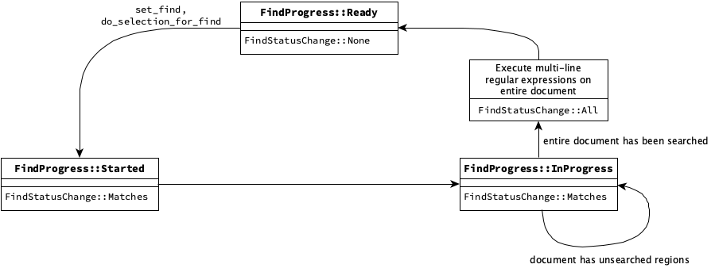

# Find and Replace

Xi editor supports find using a single single query and multiple search queries.
Additionally, searching documents is performed incrementally which is beneficial when searching large documents.

Find and replace are performed in `View`.

## RPC Commands

All the RPC commands that are related to find and replace including their parameters are listed in [Frontend Protocol](./frontend-protocol.md).

## Highlight find

`highlight_find` indicates whether find matches should be highlighted on the frontend or not.
If the user, for example, closes the search bar then `highlight_find = false` but if it is visible then `highlight_find = true`.

## Incremental Find

Incremental search starts with executing find on the visible range, since this would mean that users see visible results quickly.
After searching the visible range, find will continue searching the ranges that come before and after the visible range and continues doing that until the entire text has been searched.
These ranges will overlap with each other so that also matches will be found that might otherwise be split over two ranges.

This approach works for simple search queries and regex queries, however it does not work for regex that could match multiple lines (multi-line regex).
To also support multi-line regexes, these will be executed on the entire text after the previously described incremental find has searched the entire text.

`find_progress` keeps track of the state incremental find is in:
    * `FindProgress:Ready`: find is not running or finished
    * `FindProgress:Started`: incremental find just started, no results have been sent to the frontend yet
    * `FindProgress::InProgress(Range<usize>)`: incremental find is in progress and keeps track of the searched document region.

The implementation is similar to word wrapping. Find operations are scheduled and handled during idle.
After each do_incremental_find, find_status which contains all matches found up until this point is sent to the frontend.

### Find Status

`find_status` is used to inform the frontend about the current number of matches, lines that contain matches and the current search queries.
When and what is sent in `find_status` is controlled by `find_changed`:
    * `FindStatusChange::None`: there haven't been any find related changes and `find_status` does not need to be sent to the frontend.
        * set after `find_status` has been sent to the frontend
    * `FindStatusChange::All`: All search queries, lines with matches and the number of matches is sent
        * this takes a significant time to send and parse and should be sent only when necessary
        * set after an edit or change in search queries
    * `FindStatusChange::Matches`: Only the total number of matches is sent
        * set while incremental search is in progress

### Edits while Find is in Progress

If an edit happens then find is applied on the delta (for deletions occurrences are deleted, for insertion find is applied on the inserted text + some slope).
If the edit happens in the already searched range while incremental find is still going on, then the find results occurring there will just get updated.
If it happens outside the already searched range then the find results there will get overwritten by incremental find later by what should be the same results.

## Multiple Search Queries

Xi editor allows to add multiple search queries.
This feature might be unusual since it is not supported by other editors, but I think it improves readability when working with more complex queries.
For example, to investigate specific patterns in log files, one regex might get quite long and hard to understand:
`(Connect to 192\.168\.\d{1,3}\.\d{1,3}|Connection to host 192\.168\.\d{1,3}\.\d{1,3} (failed|interrupted)|Reconnect to 192\.168\.\d{1,3}\.\d{1,3})`
Occurrences of the different search queries can be highlighted in different colors.

The search queries can be added and removed dynamically based on the provided queries in `multi_find`.
All the queries are considered to be linked by an OR function.
This means they could also be written as one regular expression that combines the queries with OR.
All the queries support options such as case-sensitivity or regular expressions.

